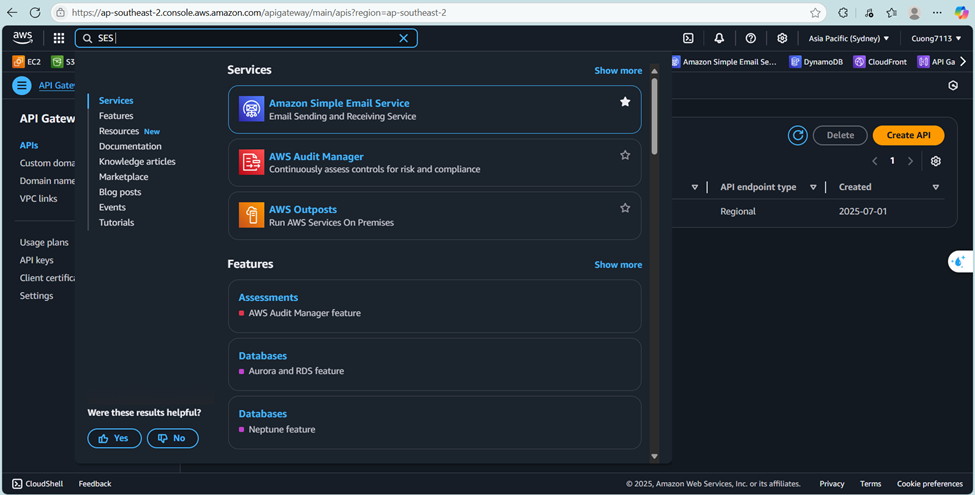
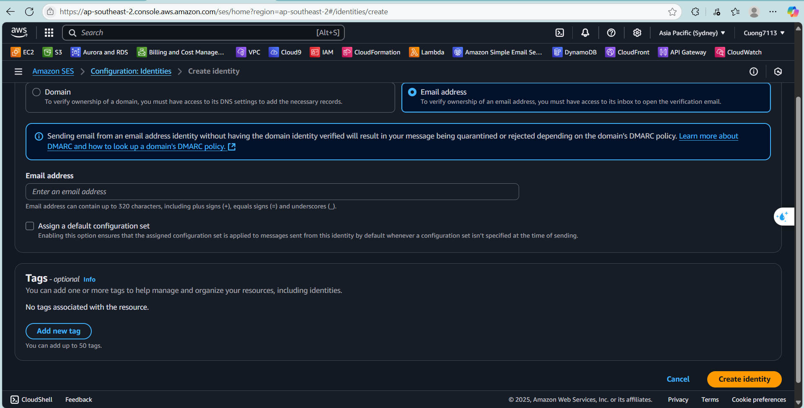
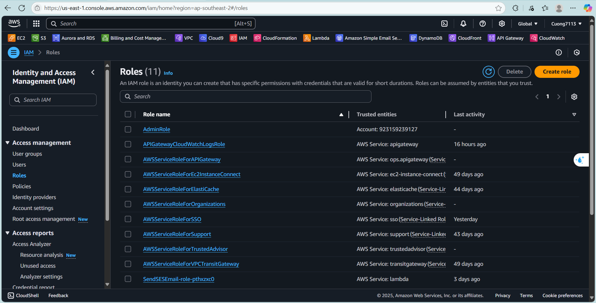

#### Tài khoản AWS

Trước tiên, bạn cần có một tài khoản AWS hợp lệ để đăng nhập vào AWS Management Console. Nếu chưa có, bạn cần đăng ký và thêm thẻ thanh toán quốc tế (Visa/Mastercard). Tài khoản này cho phép bạn sử dụng tất cả các dịch vụ AWS, bao gồm SES, Lambda, và API Gateway.

Bạn có thể đăng ký tại https://aws.amazon.com/free/ để nhận 12 tháng miễn phí một số dịch vụ giới hạn.

#### Xác minh danh tính email trong SES

Để sử dụng Amazon Simple Email Service (SES) để gửi email, bạn bắt buộc phải xác minh email (hoặc domain) trong SES trước. Nếu không xác minh, bạn sẽ không thể gửi email hoặc chỉ gửi được trong chế độ sandbox (chỉ gửi đến chính bạn).

1. Các bước:
   - Tìm kiếm **AWS SES Console**  sau đó click vào **Identities**  ở thanh bên trái.
   
   - Nhấp vào **Create Indentity** và tick vào **Email Address** sau đó click lần nữa **Create Identity**.
   
   - Vào email của bạn và click vào link để xác minh.

2. IAM Role với quyền cần thiết
   Bạn cần một **IAM Role** để Lambda function có thể thực thi. Role này cần có ít nhất:

   - AWSLambdaBasicExecutionRole (để ghi log lên CloudWatch).
   - AmazonSESFullAccess (để gửi email qua SES).
   - Các bước:

      1. Vào **IAM Console**, chọn **Roles** ở thanh bên trái, sau đó click vào **Create Role**
      
      2. Chọn **Lambda** làm use case.
      3. Gắn các policy:
      - **AWSLambdaBasicExecutionRole**
      - **AmazonSESFullAccess**
      4. Đặt tên rõ ràng (ví dụ: **Lambda-SESSendEmail-Role**) và tạo role.
   
