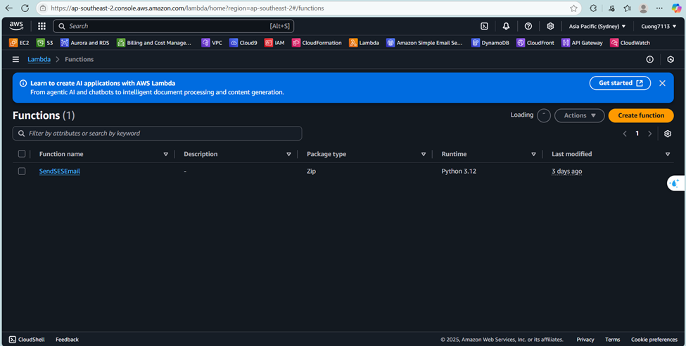

## Creating an Lambda function

1. **Go to AWS Lambda Console** on the [AWS Web Service page](https://aws.amazon.com/).

2. Click on Create function button at the top right corner.

   

3. On the left sidebar, choose **Author from scratch**, and then enter **Function details**.

   

4. Fill **Function name: SendSESEmail**, **Runtime: Python 3.12**, choose **IAM role with SES permissions**

   

5. On the right down corner, choose the yellow button **Create Function**

   

6. The creation of the Lambda Function is complete.

   

#### The Function Code

1. Roll down to the Code Source and enter this code:

```python
import boto3
import json

def lambda_handler(event, context):
    print("Event received:", event)

    ses = boto3.client('ses', region_name='ap-southeast-2')

    response = ses.send_email(
        Source='your_verified_email@example.com',  # Thay bằng email đã verify trong SES
        Destination={
            'ToAddresses': ['recipient@example.com'],
        },
        Message={
            'Subject': {'Data': 'Test email from Lambda and SES'},
            'Body': {'Text': {'Data': 'This is a test email sent using AWS Lambda and SES.'}},
        },
    )

    print("SES send_email response:", response)

    return {
        'statusCode': 200,
        'headers': {
            'Access-Control-Allow-Origin': '*',
            'Access-Control-Allow-Headers': 'Content-Type',
            'Access-Control-Allow-Methods': 'OPTIONS,POST'
        },
        'body': json.dumps({'message': 'Email sent successfully!'})
    }
```
2. Then, click the **Deploy** button on the left to deploy Lambda function or press Ctr+Shift+U 

   

3. After deploying, copy **Function ARN** to use for **API Gateway integration**.

   

#### Tip: Make sure email in **Source** is verified in SES if in sandbox mode.


