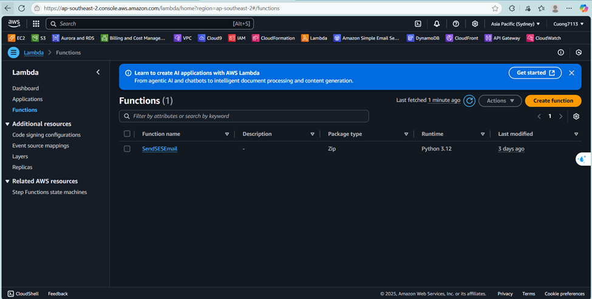
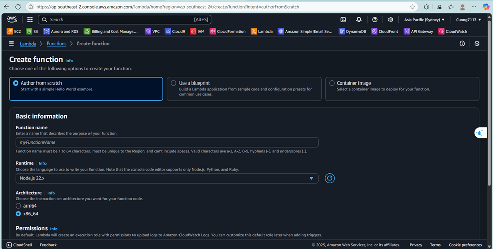
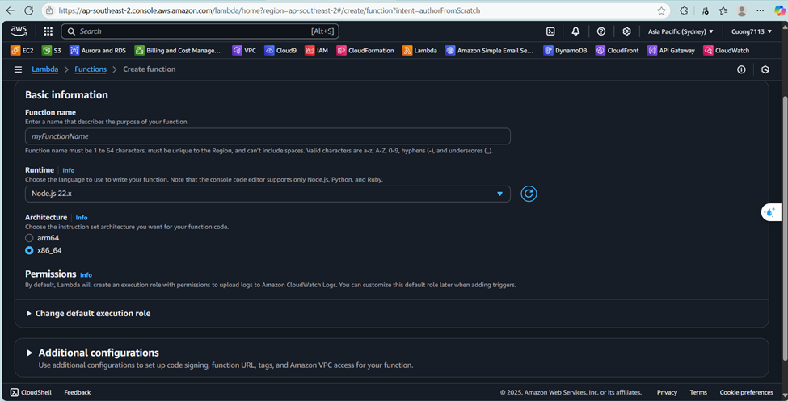
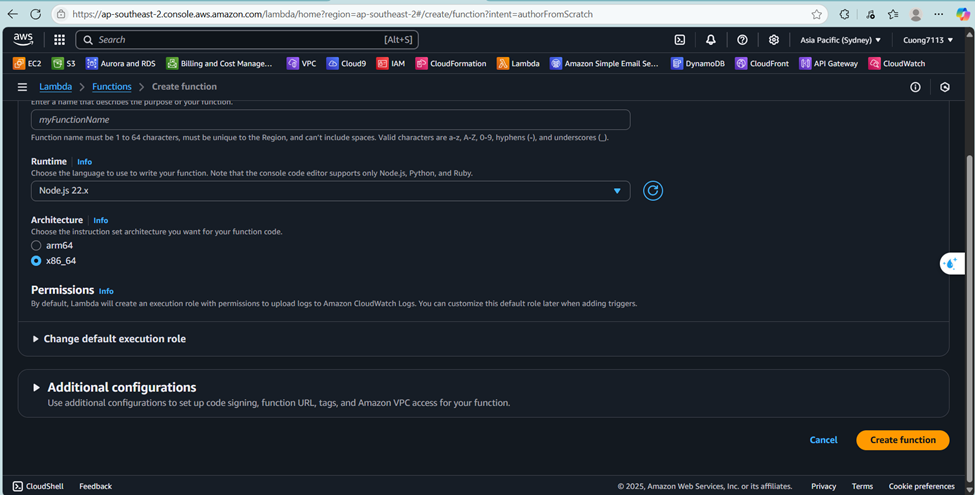
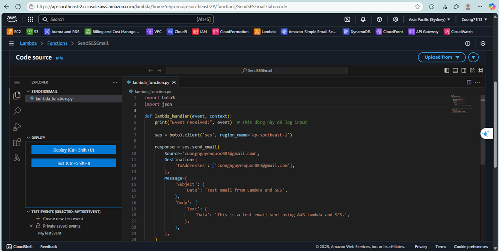
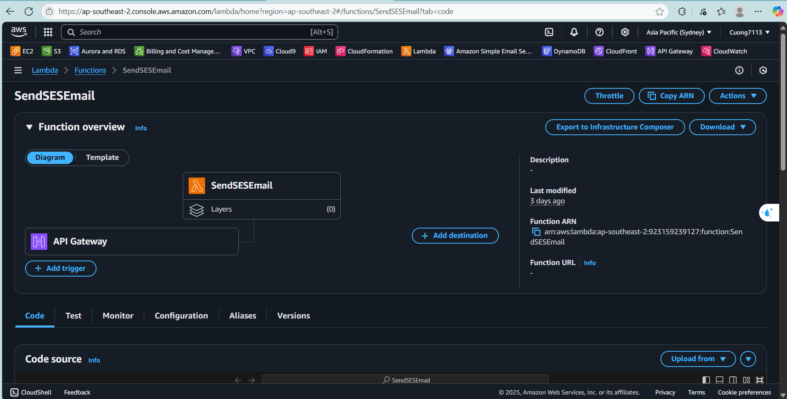

## Tạo chức năng Lambda

1. **Đi tới AWS Lambda Console** trên trang [AWS Web Service page](https://aws.amazon.com/).

2. Nhấn vào nút Create function (Tạo hàm) ở góc trên bên phải.

   

3. Ở thanh bên trái, chọn **Author from scratch**, sau đó nhập **Function details**.

   

4. Điền **Function name: SendSESEmail**, **Runtime: Python 3.12**, chọn **IAM role with SES permissions**

   

5. Ở góc dưới bên phải, chọn nút màu vàng **Create Function**

   

6. Việc tạo Lambda Function đã hoàn tất.

   


#### The Function Code

1. Kéo xuống phần Code Source (Nguồn mã) và nhập đoạn mã sau:

```python
import boto3
import json

def lambda_handler(event, context):
    print("Event received:", event)

    ses = boto3.client('ses', region_name='ap-southeast-2')

    response = ses.send_email(
        Source='your_verified_email@example.com',  # Thay bằng email đã verify trong SES
        Destination={
            'ToAddresses': ['recipient@example.com'],
        },
        Message={
            'Subject': {'Data': 'Test email from Lambda and SES'},
            'Body': {'Text': {'Data': 'This is a test email sent using AWS Lambda and SES.'}},
        },
    )

    print("SES send_email response:", response)

    return {
        'statusCode': 200,
        'headers': {
            'Access-Control-Allow-Origin': '*',
            'Access-Control-Allow-Headers': 'Content-Type',
            'Access-Control-Allow-Methods': 'OPTIONS,POST'
        },
        'body': json.dumps({'message': 'Email sent successfully!'})
    }
```
2. Sau đó, nhấp vào nút **Deploy** ở bên trái để triển khai (deploy) Lambda function hoặc nhấn Ctrl + Shift + U 

   

3. Sau khi triển khai xong, sao chép **Function ARN** để sử dụng cho việc tích hợp với **API Gateway**.

   

#### Tip: Đảm bảo email trong mục **Source** đã được xác minh trong SES nếu bạn đang ở chế độ sandbox.
