**Nội dung:**
- [Định nghĩa](#định-nghĩa)
- [Tại sao cần API Gateway?](#tại-sao-cần-api-gateway)
- [Điền kiện tiên quyết](#điều-kiện-tiên-quyết)
- [Các bước](#các-bước)

#### Định nghĩa

Amazon API Gateway là một dịch vụ được quản lý toàn phần, giúp dễ dàng tạo, xuất bản, duy trì, giám sát và bảo mật API ở bất kỳ quy mô nào.

#### Tại sao cần API Gateway?

1. Cho phép frontend (trang web) dễ dàng gửi request đến Lambda function thông qua một URL endpoint.

2. Quản lý bảo mật, xác thực, giới hạn request và giám sát API. 

3. Giúp tách biệt frontend và backend, đồng thời dễ dàng bảo trì hơn.

#### Điều kiện tiên quyết

Để thực hiện phần này, đảm bảo bạn đã:
  - Tạo và triển khai (deploy) Lambda function.
  - IAM role của Lambda function có quyền AmazonSESFullAccess.
  - Đăng nhập vào AWS Management Console với quyền tạo API Gateway và gán quyền cho Lambda function.

#### Các bước

1. Đi tới **AWS Search Bar**, tìm kiếm dịch vụ **API Gateway** rồi nhấn vào.
   Bên trong [API Gateway], chọn **Create API** ở góc phải trên cùng.

   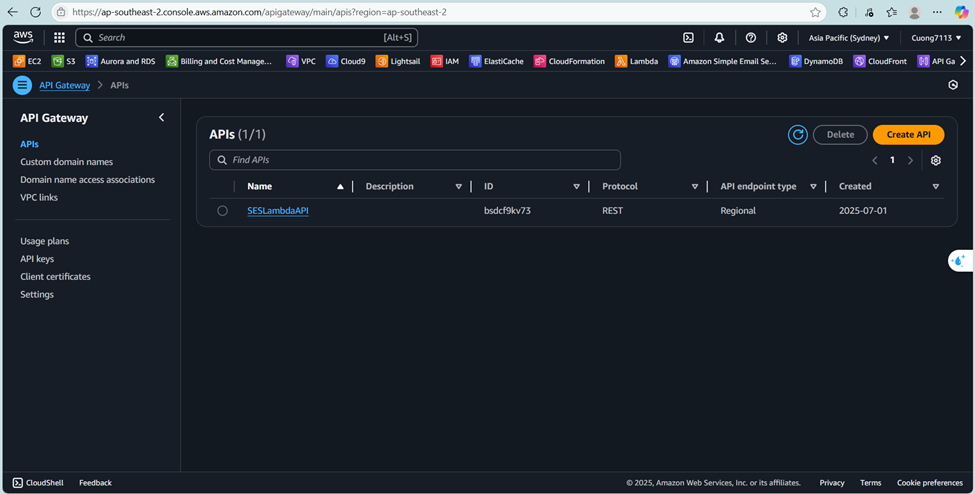

Đây là nơi bạn quản lý tất cả các API trong AWS.

2. Chọn **Rest API** và nhấn nút **Build** bên cạnh.

   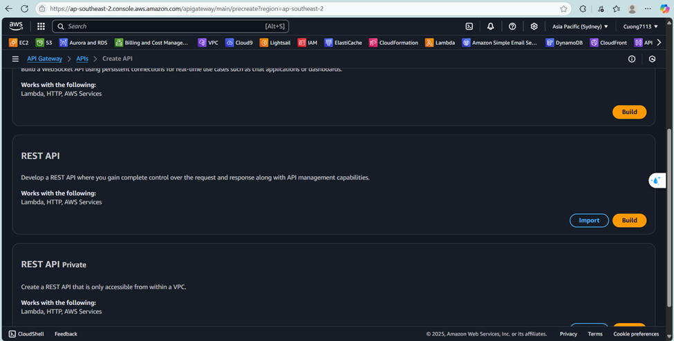

REST API phù hợp cho các ứng dụng truyền thống, backend web hoặc microservices cần nhiều HTTP methods.

3. Nhập **Chi tiết API**:
   - Chọn **API mới**.
   - Tên API: SendEmailAPI.
   - Mô tả không bắt buộc, bạn có thể nhập nếu muốn.
   - Endpoint Type: Regional
   - Nhấp vào **Create API** để tạo.

   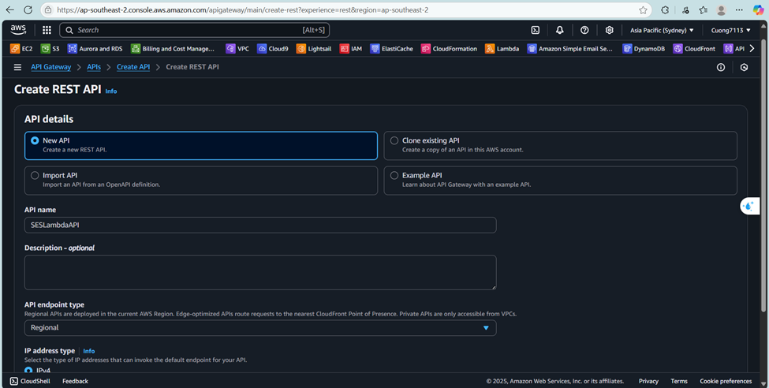

   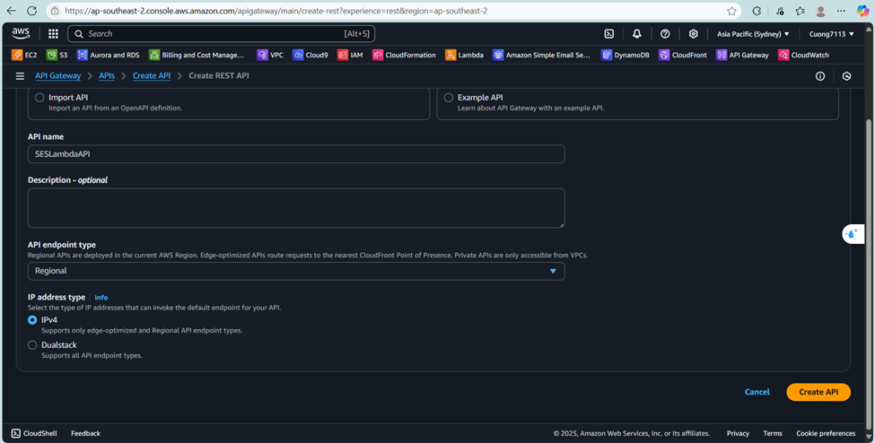

   Created successfully:

   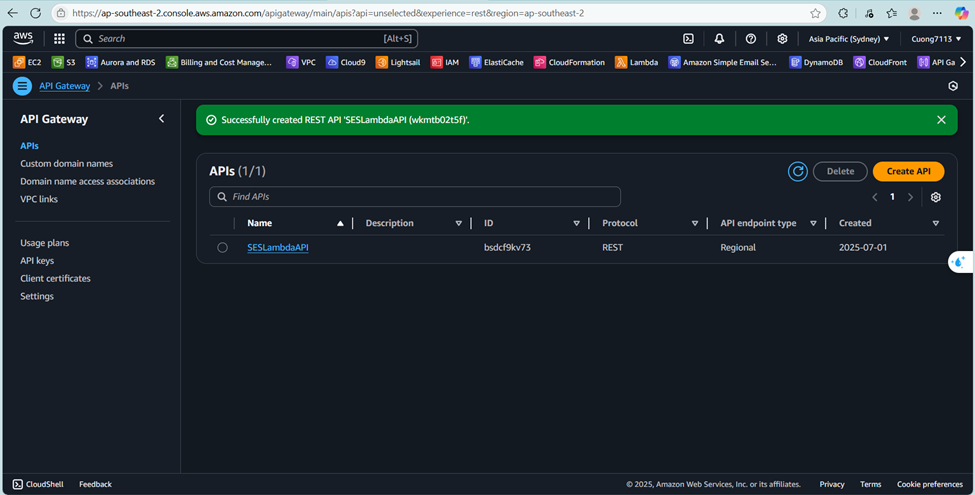

4. Tạo **resource /sendemail**

   - Click vào tên API bạn vừa tạo rồi chọn nút **Create Resource**.

   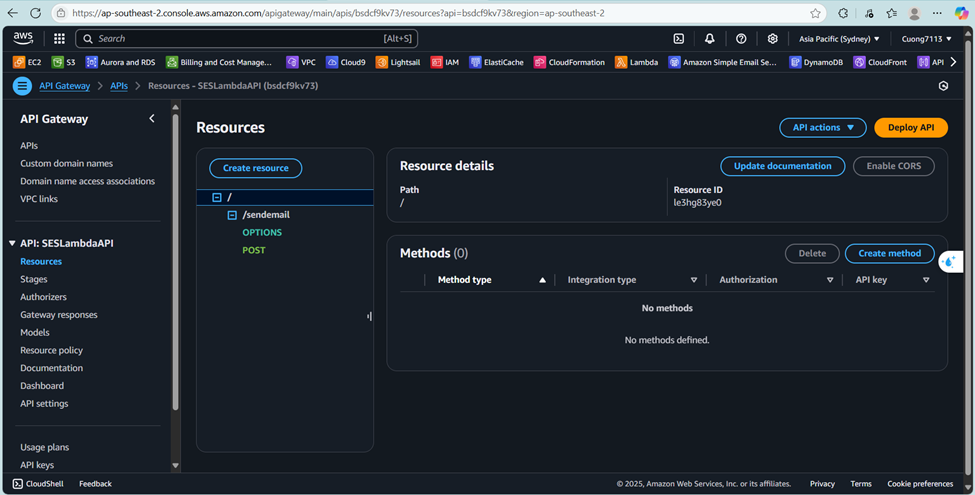

   - Resource Name: sendemail 
   Bạn có thể click vào CORS (Cross Origin Resource Sharing) nếu muốn, vì nó sẽ tạo method OPTIONS cho phép tất cả origins, tất cả methods và các headers phổ biến.

   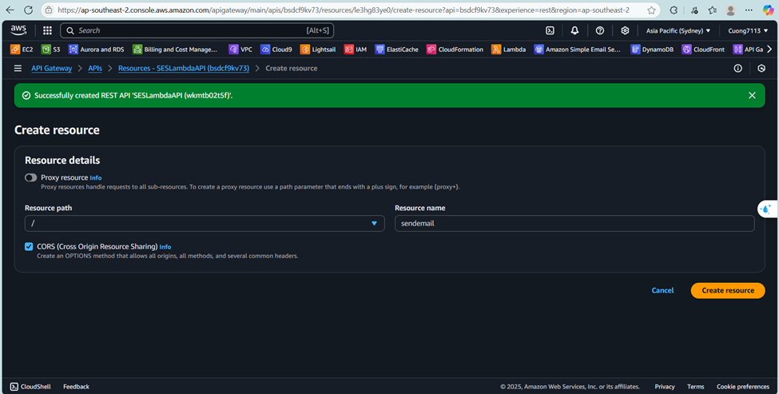

5. Tạo **POST method for /sendemail**

   Click vào **resource /sendemail** và chọn **Create Method** sau đó chọn **Post** từ **Method Type**

   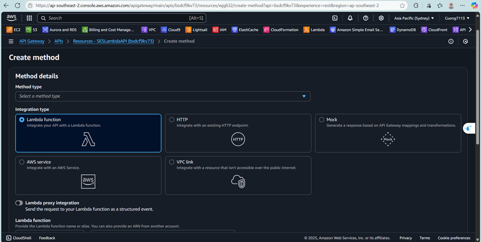
   rồi nhấn nút  **Create Method**
   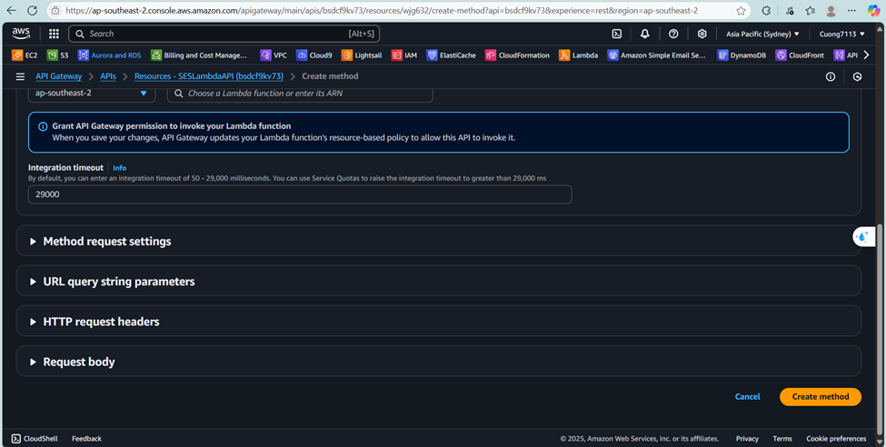
   Sau khi tạo thành công: 
   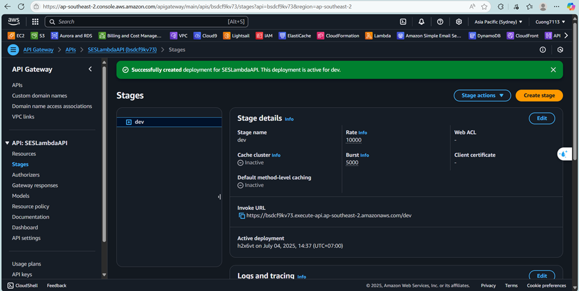
   POST method được dùng để gửi dữ liệu từ client lên server. Ở đây, ta sẽ gửi nội dung email từ frontend lên Lambda để gửi qua SES.

6. Bật **Enable CORS** cho method POST của /sendemail

   Nhấp vào **resource /sendemail** và chọn nút  **Enable CORS**
   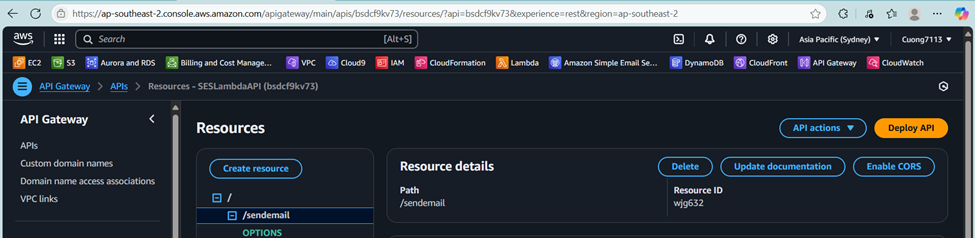
   Trong popup, đảm bảo:
   - Access-Control-Allow-Origin: *
   - Access-Control-Allow-Methods: OPTIONS,POST
   Sau đó nhấn Save.
   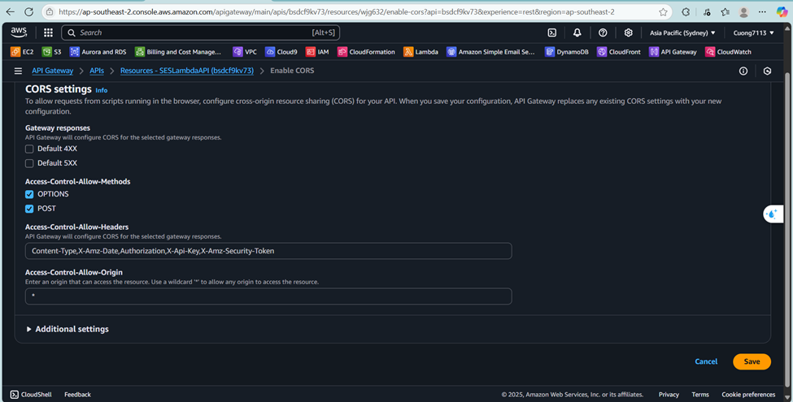
   Lưu thành công:
   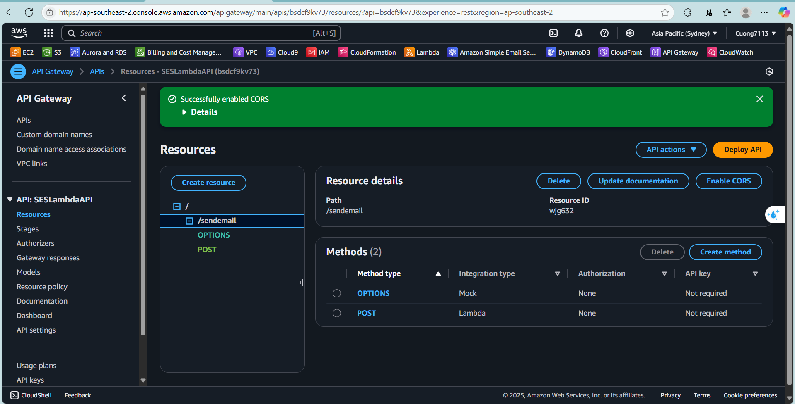
{}
Tại sao cần CORS?
Vì khi frontend chạy ở một domain khác (ví dụ: localhost:5500) gọi API Gateway (một domain khác), trình duyệt sẽ chặn request nếu không có CORS headers.
{}

7. Deploy API lên stage
   - Nhấp vào nút **Deplou API** sau đó chọn **New stage** trong Stage options.
   - Stage name: dev rồi nhấp **Deploy**
   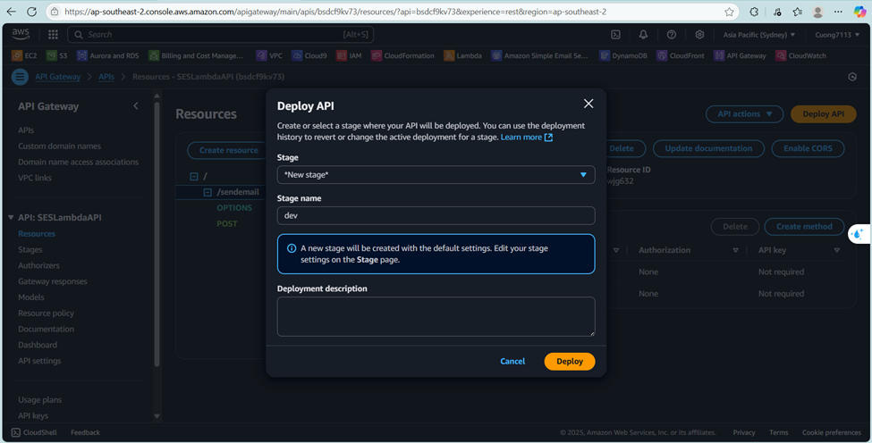
   Sau khi deploy, bạn sẽ thấy Invoke URL như:
   (https://your-api-id.execute-api.ap-southeast-2.amazonaws.com/dev)
   Đây là URL endpoint được frontend dùng để gọi API.
   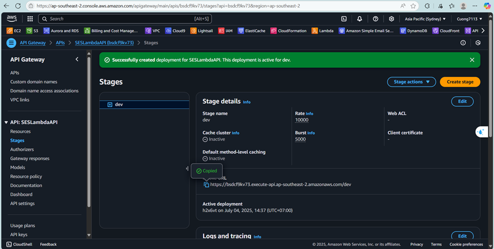
