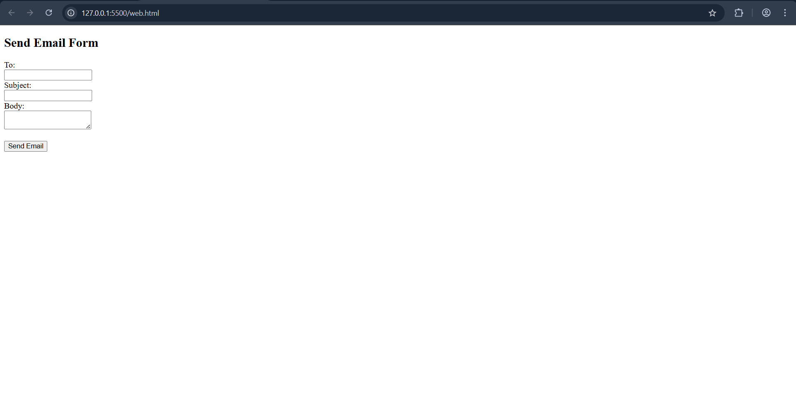
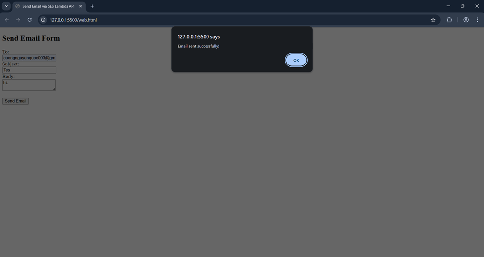
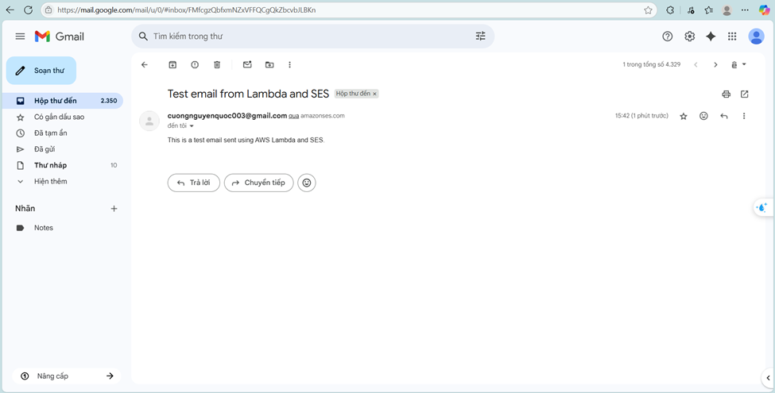

**Nội dung:**
- [Định nghĩa](#định-nghĩa)
- [Tại sao cần kiểm tra tích hợp?](#tại-sao-cần-kiểm-tra-tích-hợp)
- [Điền kiện tiên quyết](#điều-kiện-tiên-quyết)
- [Các bước](#các-bước)

#### Định nghĩa

Kiểm tra tích hợp Frontend là quá trình kiểm tra kết nối giữa giao diện người dùng (frontend) và API backend.

#### Tại sao cần kiểm tra tích hợp?

Để đảm bảo frontend gọi đúng API, nhận phản hồi và hiển thị dữ liệu chính xác. Đồng thời phát hiện sớm lỗi nếu endpoint API, method, CORS hoặc cấu hình Lambda không đúng, cũng như xác minh luồng end-to-end: người dùng nhập dữ liệu ➔ gọi API ➔ Lambda xử lý ➔ SES gửi email ➔ nhận phản hồi thành công.

#### Điều kiện tiên quyết

Trước khi bắt đầu, đảm bảo:
- Endpoint của API Gateway đang hoạt động và method POST trả về 200 OK.
- Lambda function hoạt động đúng và có quyền SES để gửi email.
- Danh tính SES (email hoặc domain) đã được xác minh.
- Trình duyệt có kết nối internet và có thể truy cập endpoint API Gateway.

#### Các bước

1. Tạo file web.html

   Đây là file HTML đơn giản để kiểm tra việc gửi form email thông qua API Gateway ➔ Lambda ➔ SES.

```
<!DOCTYPE html>
<html>
<head>
    <title>Send Email via SES Lambda API</title>
</head>
<body>
    <h2>Send Email Form</h2>
    <form id="emailForm">
        To:<br>
        <input type="text" id="to" value="recipient@example.com"><br>
        Subject:<br>
        <input type="text" id="subject" value="Test email via SES Lambda"><br>
        Body:<br>
        <textarea id="body">hello,</textarea><br><br>
        <button type="submit">Send Email</button>
    </form>

    <script>
        document.getElementById('emailForm').addEventListener('submit', function(e) {
            e.preventDefault();
            fetch('YOUR_API_GATEWAY_URL/sendemail', {
                method: 'POST',
                headers: { 'Content-Type': 'application/json' },
                body: JSON.stringify({
                    to: document.getElementById('to').value,
                    subject: document.getElementById('subject').value,
                    body: document.getElementById('body').value
                })
            })
            .then(res => res.json())
            .then(data => alert(data.message))
            .catch(err => console.error(err));
        });
    </script>
</body>
</html>
```

2. Bước tiếp theo 
Thay thế YOUR_API_GATEWAY_URL bằng Invoke URL từ stage API Gateway mà bạn đã deploy.
(Ví dụ:)
```
js
Copy
Edit
fetch('https://your-api-id.execute-api.ap-southeast-2.amazonaws.com/dev/sendemail'),
```
sau đó khởi chạy website: 

FĐiền thông tin email, sau đó nhấn Send Email (Gửi Email), bạn sẽ thấy thông báo "Email sent successfully!" (Gửi email thành công!) nếu mọi thứ hoạt động bình thường.

Kiểm tra hộp thư của người nhận để xem email đã được gửi đến chưa.


3. Khắc phục sự cố

- Lỗi CORS: Check if CORS is enabled on API Gateway.
- Lỗi Permission: Check Lambda IAM Role has AmazonSESFullAccess.
- Không nhận được email: SES ở chế độ sandbox chỉ cho phép gửi tới các email đã được xác minh.
- Lỗi Fetch hoặc 403: Kiểm tra URL endpoint, method, và region.
