**Nội dung:**
- [Định nghĩa](#định-nghĩa)
- [Tại sao cần giám sát và nhật kí?](#tại-sao-cần-giám-sát-và-nhật-kí)
- [Điền kiện tiên quyết](#điều-kiện-tiên-quyết)
- [Các bước](#các-bước)

#### Định nghĩa

Monitoring và Logs là việc giám sát các hoạt động của hệ thống và xem các log chi tiết để debug (gỡ lỗi), tối ưu hóa, hoặc đảm bảo hiệu suất ổn định cho ứng dụng.

#### Tại sao cần giám sát và nhật kí?

Giúp kiểm tra Lambda function có chạy thành công hay không, dễ dàng debug khi API Gateway ➔ Lambda ➔ SES gặp lỗi. Theo dõi số lần gọi (invocations), thời gian thực thi (duration), và lỗi (errors) để tối ưu chi phí.

#### Điều kiện tiên quyết

Trước khi bắt đầu, đảm bảo:
- Lambda function đã được deploy thành công.
- Bạn có quyền truy cập vào AWS CloudWatch Logs.
- Có hiểu biết cơ bản về CloudWatch Alarm để tạo cảnh báo khi cần.

#### Steps

1. Truy cập **AWS Management Console**, tìm kiếm dịch vụ **CloudWatch**.
   Trong menu bên trái, chọn Logs ➔ Log groups.

   Tìm **Log group** của Lambda function của bạn theo định dạng:

   ```/aws/lambda/YourFunctionName```
   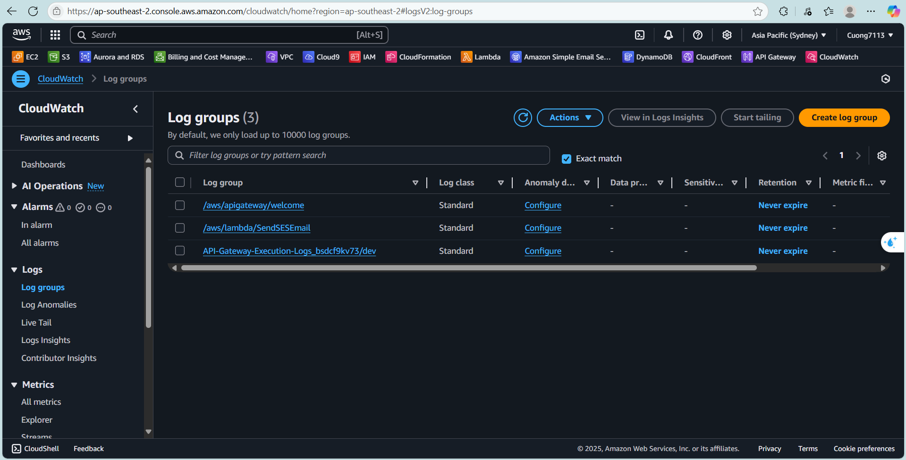
   Nhấp vào **Log group** ➔ Chọn log stream gần đây nhất
   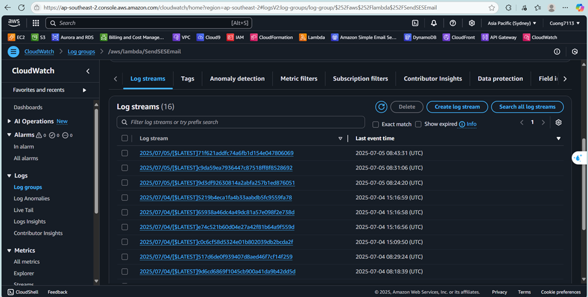
   ➔ Xem các log chi tiết.
   Ví dụ:

   ```START RequestId: xxx Version: $LATEST
   Event received: {event data}
   SES send_email response: {response data}
   END RequestId: xxx
   REPORT RequestId: xxx Duration: xxx ms Billed Duration: xxx ms Memory Size: xxx MB Max Memory Used: xxx MB```

   (Ý nghĩa: Hiển thị rằng hàm đã chạy, nhận đầu vào, trả về đầu ra, thời gian thực thi và lượng bộ nhớ đã sử dụng.)

   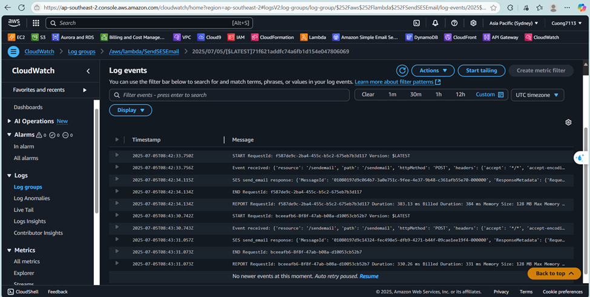

2. Tạo CloudWatch Alarm (Tùy chọn)

   CloudWatch Alarm là một cảnh báo được kích hoạt khi một chỉ số (metric) vượt quá ngưỡng đã định, ví dụ: số lỗi của Lambda vượt quá giới hạn cho phép.

   - Truy cập **CloudWatch Console**, ở thanh bar bên trái chọn **All Alarms**, sau đó nhấp vào **Create alarm**.
   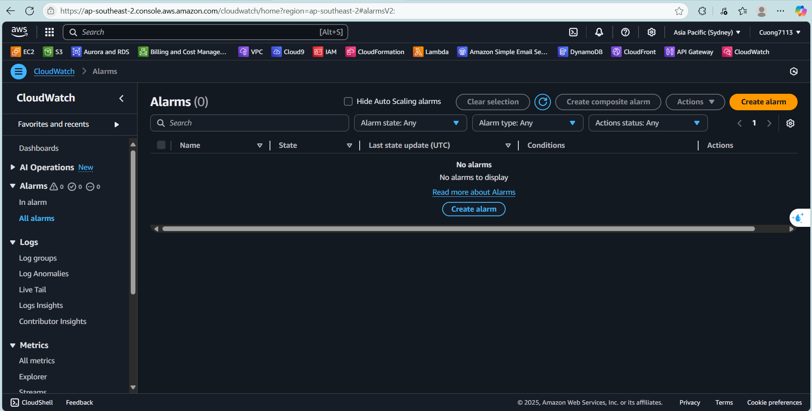
   - Nhấp vào nút **Select metric**, và chọn **Lambda** ➔ **By Function Name** ➔ **Errors**
   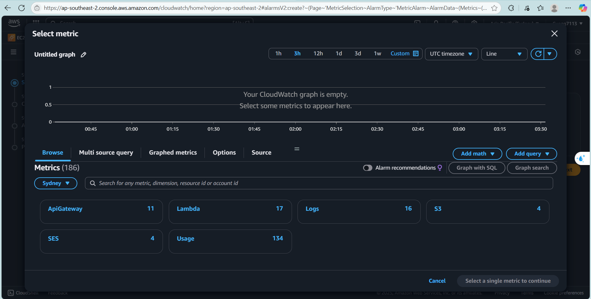
   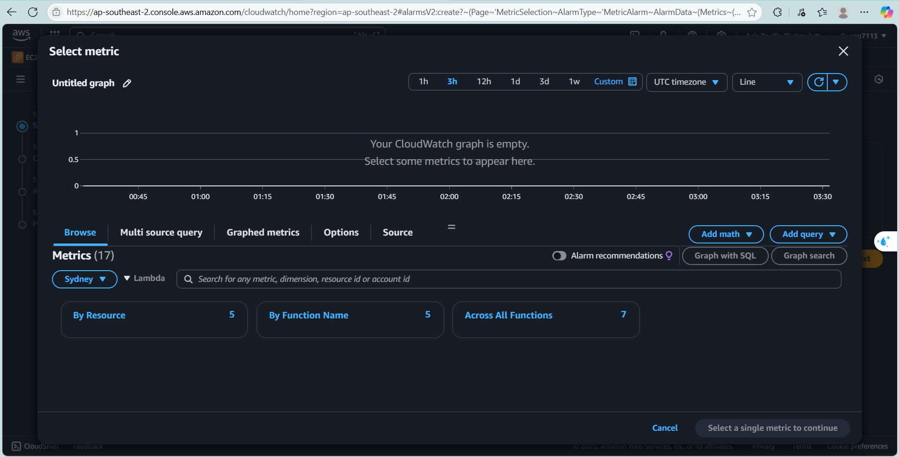
   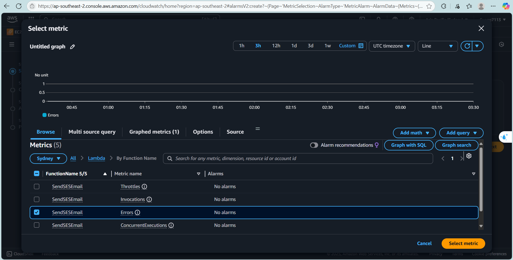
   - Ở đây, nếu bạn chưa tạo bất kỳ **SNS topic** nào trước đó, trường Select an SNS topic (Chọn SNS topic) sẽ hiển thị là Required (Bắt buộc).
   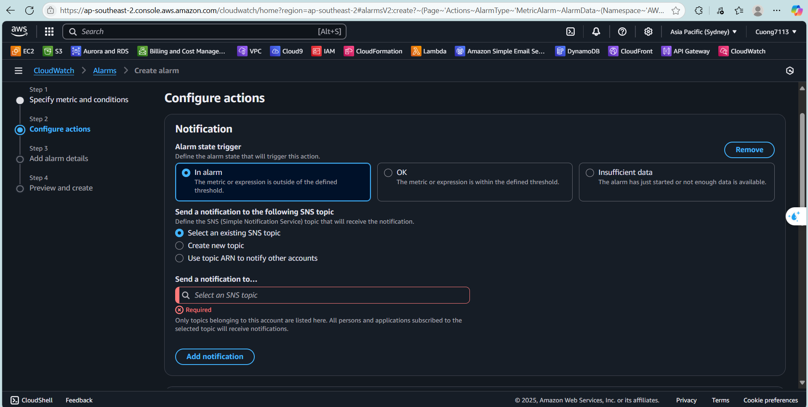
   Vì vậy đây là hướng dẫn nhanh: Tạp **SNS topic** để sử dụng cho **Alarm**.
   - Chọn **SNS(Simple Notification Service)** trong AWS Console.
   - Chọn và đặt tên cho **Create topic** ➔ chọn **Standard**.
   - Tên đề tài: ví dụ **AlarmNotificationTopic** ➔ nhấp vào **Create Topic**.
   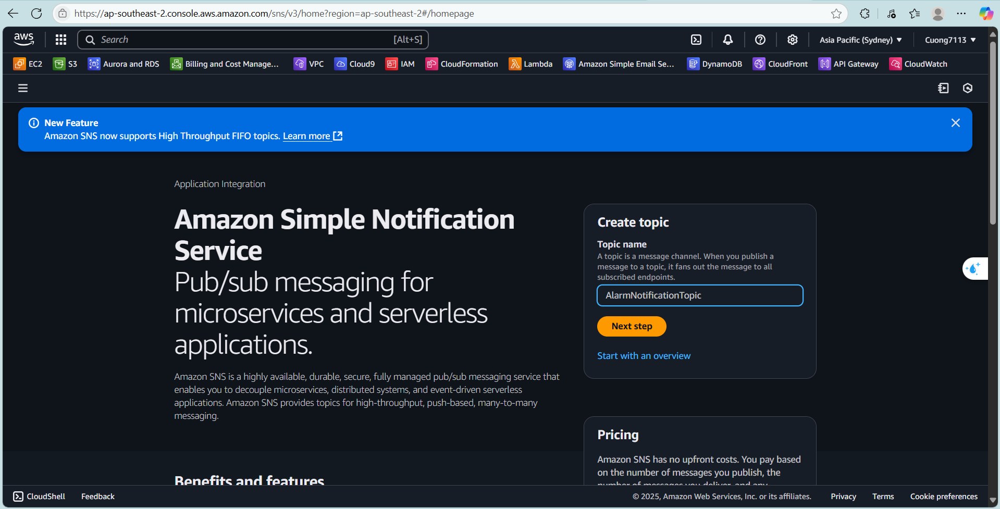
   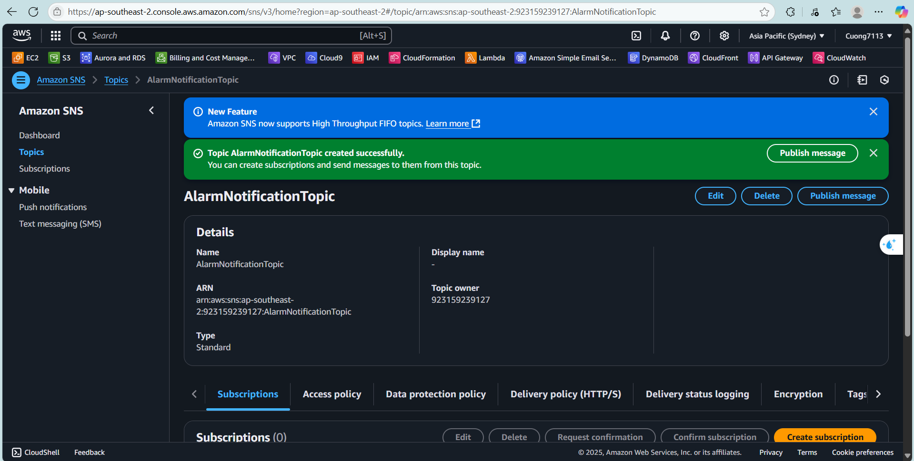
   - Tại đề tài bạn vừa tạo, chọn **Create subscription**.
   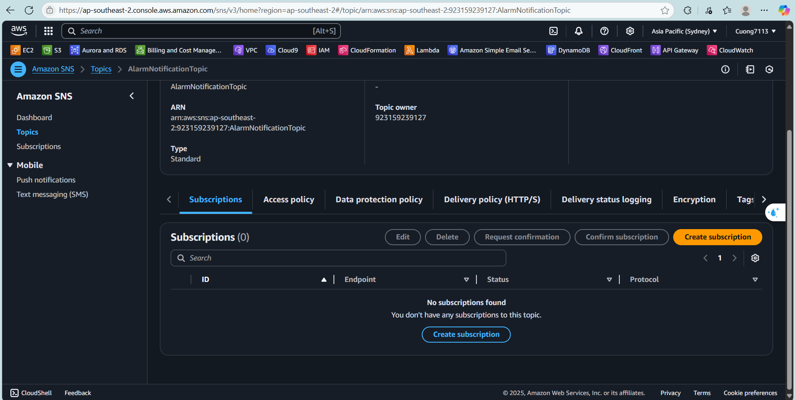
      - Protocol: chọn Email.
      - Endpoint: Nhập email mà bạn muốn nhận thông báo (ví dụ: yourmail@gmail.com).
      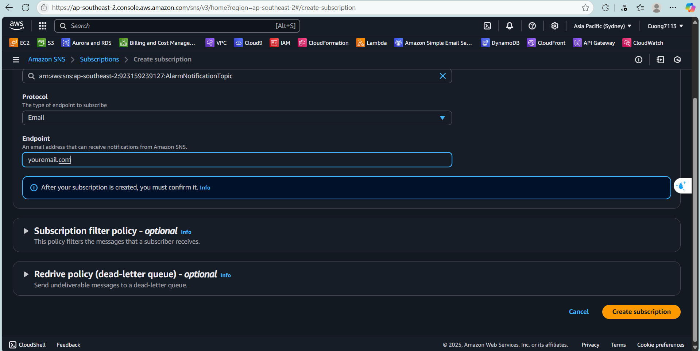
   - Truy cập email của bạn ➔ Xác nhận **Subscription**.
   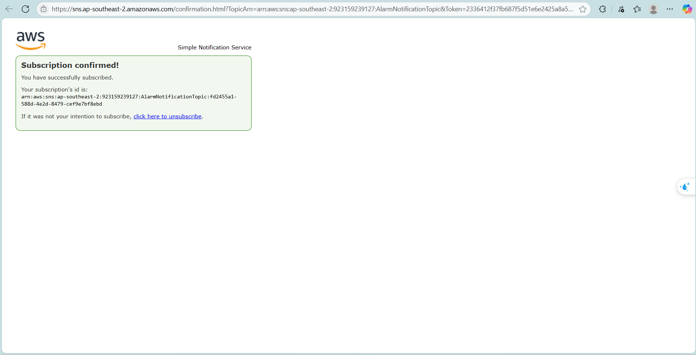
   Sau khi tạo xong **SNS topic** và **Subscription**, quay trở lại **CloudWatch Alarm**, reload, và bạn sẽ thấy **SNS topic** xuất hiện trong danh sách. Chọn nó, sau đó tiếp tục:
   - Đặt tên cho alart. ví dụ: **LambdaSESErrorAlarmTopic**
   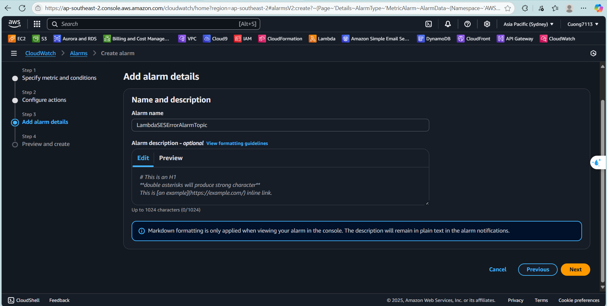
   - Preview và nhấp **Create Alarm**
   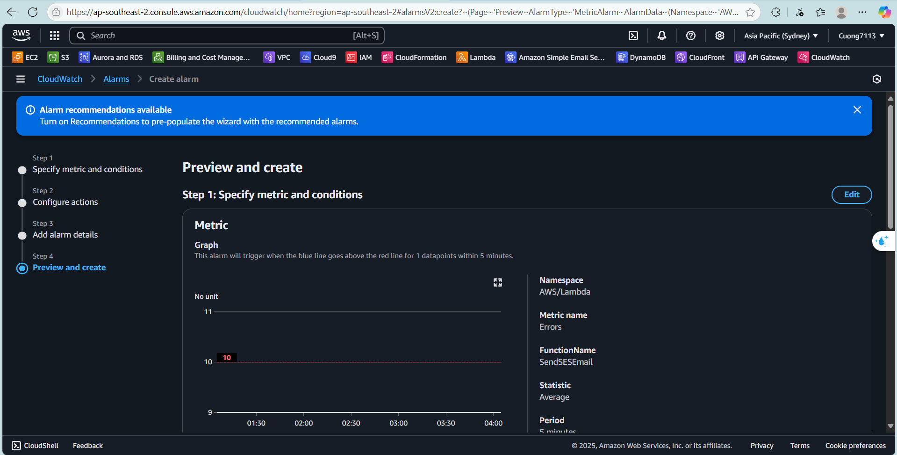
   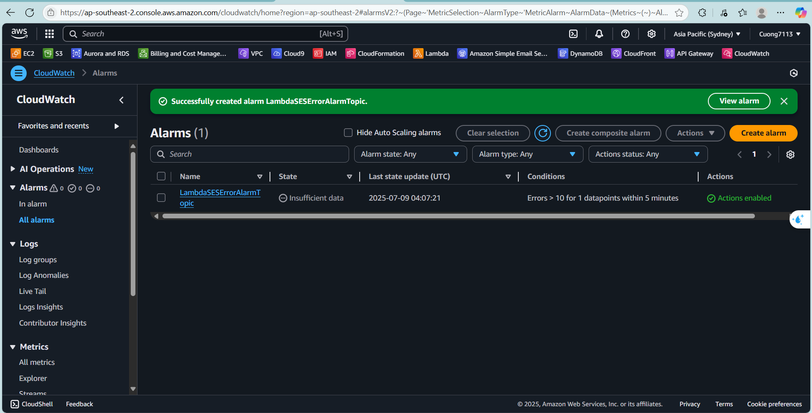